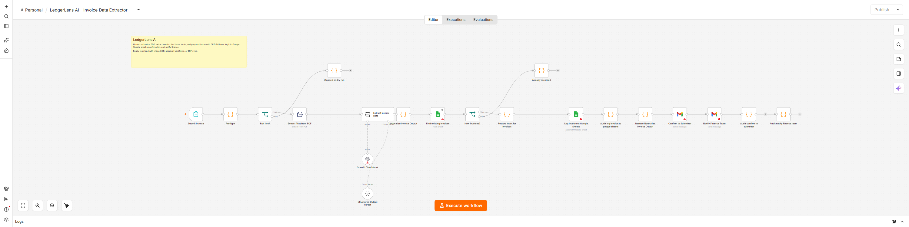

# LedgerLens AI

When someone submits a PDF invoice through the n8n form, save its details for finance review, send the two notices, and stop.

These images show a local n8n editor. Red icons mean credentials still need to be connected on your own instance.

[Form and safety checks](screenshots/n8n-start.png) · [Sheet and email steps](screenshots/n8n-finish.png)

## What it does

The workflow checks the submitter's email and PDF, extracts invoice fields with OpenAI, and saves a row in Google Sheets. Vendor name and invoice number make the invoice key. A later sequential run with the same key stops before email. A finance person must check the extracted dates, amounts, currency, and Philippine VAT treatment. The workflow never approves or pays an invoice, changes an accounting ledger, or deletes files.

Success means an Invoices row with Invoice Key and Run ID, and two Gmail sends in the n8n execution. The form submission is the trigger. Finance operations owns this workflow.

## Set up

1. On self-hosted n8n, import LedgerLens AI.json and Failure Alert.json. Connect OpenAI, Google Sheets, and Gmail credentials. Give the Google account access only to the needed spreadsheet and mailbox.
2. Make an Invoices tab with these exact headers: Invoice Key, Run ID, Submitted By, Submitted At, Vendor Name, Vendor Email, Vendor Address, Invoice Number, Invoice Date, Due Date, Currency, Subtotal, Tax, Total, Payment Terms, Line Items, Notes, Status.
3. Set INVOICE_SHEET_ID, FINANCE_EMAIL_TO, and LEDGERLENS_ALERT_EMAIL_TO in the server environment. The alert address must reach the finance operator. Keep OAuth and API keys in n8n credentials, never in this repo. On this dedicated instance, set N8N_BLOCK_ENV_ACCESS_IN_NODE=false so Code nodes can read workflow settings.
4. In the main workflow's n8n Settings, choose the imported Failure Alert workflow as its Error Workflow. Connect its Gmail node and test the alert. Restrict access to invoice executions and saved data.
5. Set N8N_FORMDATA_FILE_SIZE_MAX=10 to cap form uploads at 10 MiB. Set N8N_CONCURRENCY_PRODUCTION_LIMIT=1 to reduce overlapping production runs. Manual runs can still overlap; Sheets has no unique key constraint.

LEDGERLENS_ENABLED=true allows a run. Dry run is on unless LEDGERLENS_DRY_RUN=false. A dry run stops before PDF extraction, OpenAI, Sheets, or Gmail. Set LEDGERLENS_ENABLED=false and deactivate the workflow to stop new runs.

## Test before using real invoices

1. Run python smoke_test.py after edits. It exits nonzero on failure. GitHub Actions runs it on pushes and pull requests.
2. Enable the workflow flag and leave dry run on. Submit a sample PDF; confirm the execution says dry_run and makes no external call.
3. Use a test sheet and inbox, set LEDGERLENS_DRY_RUN=false, and submit a sample invoice. Check its row and both emails. Submit it again; check that no second row or email appears.
4. Try a missing PDF, a bad email, and a failed alert before a real launch.

## If something fails

n8n logs the time, run ID, and result. Failure Alert emails LEDGERLENS_ALERT_EMAIL_TO. If the row was saved but an email failed, inspect the n8n execution and Gmail Sent folder, then send only the missing notice by hand. A Gmail timeout may mean the message was sent. Rerunning the invoice will stop at its saved key.

The workflow has a 300 second run limit and a 30 second AI timeout. Sheet and Gmail writes are not retried after an uncertain result. The sheet lookup and upsert avoid ordinary rerun duplicates, but simultaneous submissions can still create two rows. Reconcile them manually. If n8n is offline, ask the submitter to resubmit after recovery. Use an outside uptime monitor because n8n cannot email about its own outage.

Review the owner, inbox, and sheet every quarter. Retire the workflow when the finance process ends. Before using real data, test the alert, kill switch, and a full run with test credentials. Offline tests and screenshots do not prove live Google, Gmail, or OpenAI access.

## Go-live check

- [ ] Dry run was tested; it touched no live account.
- [ ] Secrets are in n8n credentials, and required environment settings are present.
- [ ] The same item was run twice in a test account with no duplicate side effect.
- [ ] Timeouts and retry limits were checked; uncertain Gmail or Sheets writes are reviewed by a person.
- [ ] Failure Alert reaches the named operator, and an outside monitor covers n8n outages.
- [ ] The operator knows how to set LEDGERLENS_ENABLED=false and deactivate the workflow.\n
